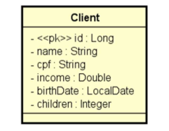

# CRUD-CLIENT


Projeto backend construído com **Spring Boot** e banco de dados **H2 (em memória)** para gerenciamento de clientes, com foco em validação de dados, tratamento de erros e boas práticas REST.


## Diagrama da Entidade Client



---

## 🔧 Funcionalidades

A API permite:

- Buscar cliente por ID
- Listar clientes com paginação
- Inserir cliente com validações
- Atualizar dados de cliente
- Deletar cliente

---

## ✅ Critérios de Testes Realizados

| Critério                                                                                  | Resultado |
|-------------------------------------------------------------------------------------------|-----------|
| ✔️ Busca por ID retorna cliente existente                                                 | ✅ OK      |
| ✔️ Busca por ID retorna 404 para cliente inexistente                                      | ✅ OK      |
| ✔️ Listagem paginada retorna corretamente                                                 | ✅ OK      |
| ✔️ Inserção de cliente com dados válidos                                                  | ✅ OK      |
| ✔️ Inserção com dados inválidos retorna 422 e mensagens customizadas                      | ✅ OK      |
| ✔️ Inserção falha se CPF for nulo ou já existente                                         | ✅ OK      |
| ✔️ Atualização de cliente com dados válidos                                               | ✅ OK      |
| ✔️ Atualização retorna 404 para cliente inexistente                                       | ✅ OK      |
| ✔️ Atualização com dados inválidos retorna 422 e mensagens customizadas                   | ✅ OK      |
| ✔️ Deleção de cliente existente                                                           | ✅ OK      |
| ✔️ Deleção retorna 404 para cliente inexistente                                           | ✅ OK      |

---

## 🧪 Validações implementadas (Bean Validation)

| Campo           | Validação                                                    |
|-----------------|---------------------------------------------------------------|
| `name`          | `@NotBlank` – nome não pode ser vazio                         |
| `cpf`           | `@NotNull` – obrigatório; também verificado para duplicação   |
| `birthDate`     | `@NotNull`, `@PastOrPresent` – data não pode ser futura       |

---

## 🛠️ Tecnologias Utilizadas

- Java 17
- Spring Boot
  - Spring Web
  - Spring Data JPA
  - Bean Validation (Jakarta)
- Banco H2 (em memória)
- Maven
- Postman (para testes)

---

## ⚙️ Como Executar

```bash
git clone https://github.com/willAtaides/CRUD-CLIENT.git
cd CRUD-CLIENT
./mvnw spring-boot:run
```


##🔗 Acesso ao Sistema

Sistema: http://localhost:8080

Console do H2: http://localhost:8080/h2-console

Dados de conexão H2:

```txt
JDBC URL: jdbc:h2:mem:testdb
Usuário: sa
Senha: (em branco)
```

## Exemplo de Requisição com Erro
POST /clients

```json

{
  "name": "",
  "cpf": null,
  "birthDate": "2099-01-01"
}
```

Resposta 422:

```json
{
  "timestamp": "2025-07-13T14:00:00Z",
  "status": 422,
  "error": "Erro de validação",
  "path": "/clients",
  "erros": [
    { "fieldName": "name", "messsage": "Campo obrigatório não preenchido: Nome do cliente." },
    { "fieldName": "cpf", "messsage": "Campo obrigatório não preenchido: CPF do cliente." },
    { "fieldName": "birthDate", "messsage": "A data de nascimento não pode ser uma data futura." }
  ]
}
```

## Exemplos de Requisições
- Busca de cliente por ID
```http
GET /clients/1
```
- Busca paginada de clientes
```http
GET /clients?page=0&size=6&sort=name
```
- Inserção de novo cliente
```http
POST /clients
Content-Type: application/json
```
```json
{
  "name": "Maria Silva",
  "cpf": "12345678901",
  "income": 6500.0,
  "birthDate": "1994-07-20",
  "children": 2
}
```

- Atualização de cliente
```http
PUT /clients/1
Content-Type: application/json
```
```json
{
  "name": "Maria Silvaaa",
  "cpf": "12345678901",
  "income": 6500.0,
  "birthDate": "1994-07-20",
  "children": 2
}
```

- Deleção de cliente
```http
DELETE /clients/1
```

##📬 Contato
Desenvolvido por Willian Ataides
📧 Willian.ataides@hotmail.com


